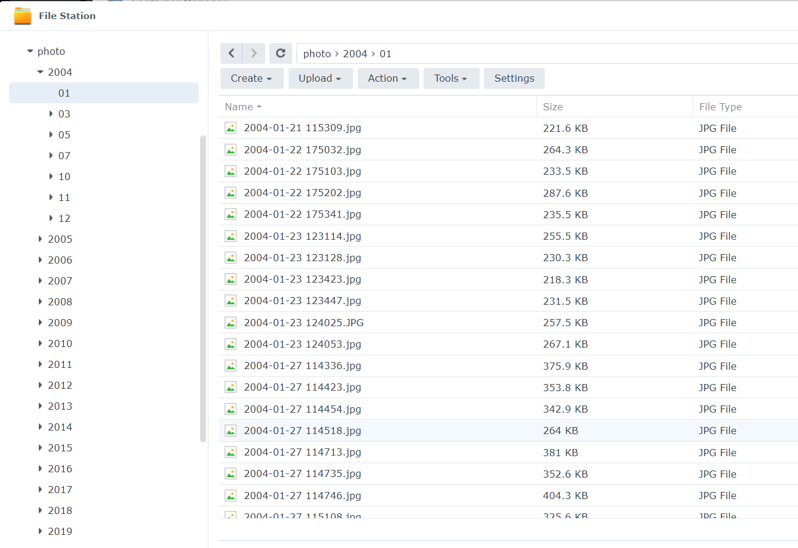

# 群晖photos照片视频整理工具

自用脚本，仓促开源，有需要可以自取，欢迎点赞转发。

## 目标

自动按年月整理群晖photos里的照片。

## 原理

脚本定期检查sourceDir下的媒体文件，然后通过exiftool获取文件的exif信息，根据里面的日期将文件自动改名并放置在对应年月的文件夹里。

照片默认放置到imageDir里，视频默认放置在videoDir里，如果exiftool没有从文件获取到对应的日期信息，那么会放置在otherDir里，有需要的话可以后面配合手工整理。

最终的效果如图：



## 基本步骤

1. 将photos.py放在某个目录下，比如download里，在下面的脚本里，目录就是/volume1/download。
2. 安装 python 3，dsm6 需要自己安装，dsm7 已经内置。
3. 进 ssh 运行 "pip install -r requirements.txt"
4. 安装 exiftool
5. 打开群晖控制面板，在任务计划里添加一个用户脚本，设定执行周期，比如每天执行一次，或者每个小时执行一次，根据自己的需要设定。

## Q&A

Q:
怎么调整源和目标目录？
A:
打开py文件，修改以下几个参数。

```python
sourceDir = '/volume1/photo/upload/'
imageDir = '/volume1/photo/'
videoDir = '/volume1/photo/video/'
otherDir = '/volume1/photo/others/'
```

Q:
怎么安装python 3？
怎么安装pip？
怎么安装exiftoo？
怎么......
A:
请打开baidu/bing/google，搜索群辉加关键词。
